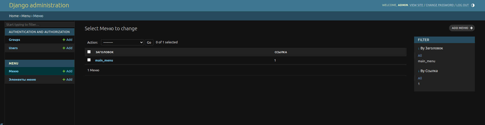
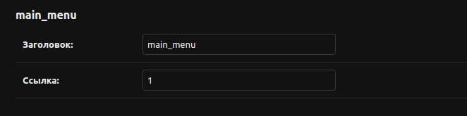
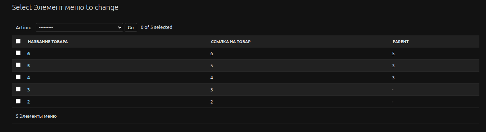
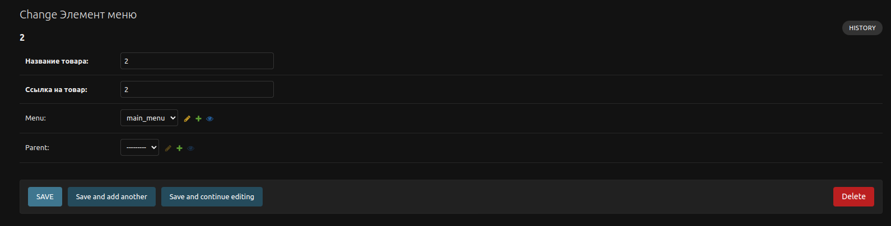
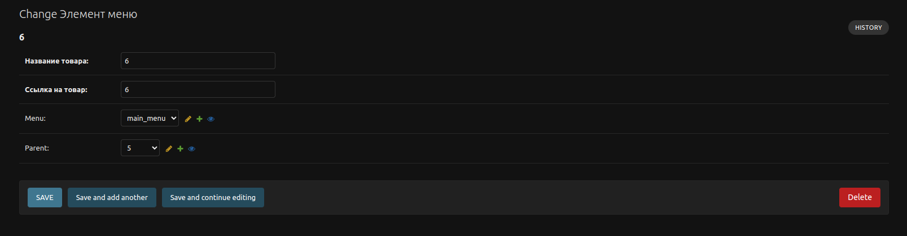
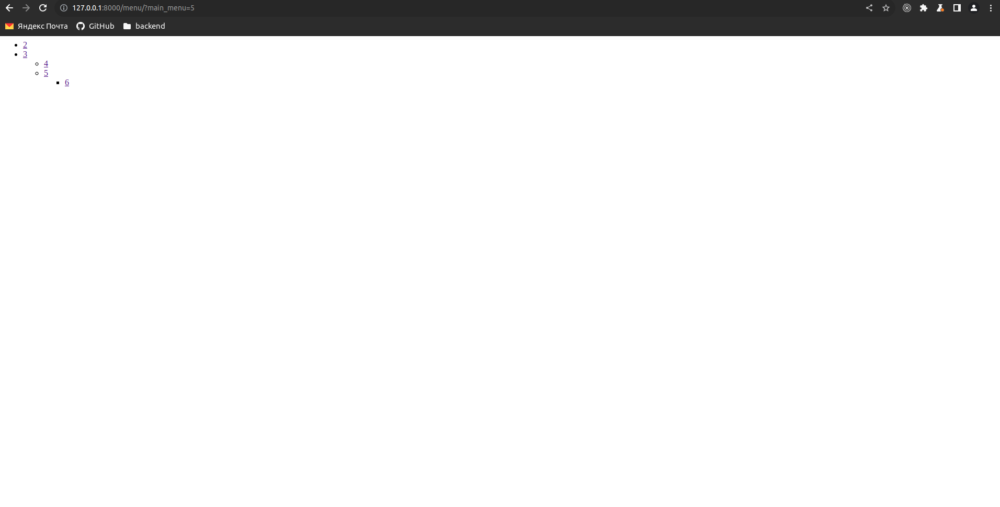

# **Задание**
Нужно сделать django app, который будет реализовывать древовидное меню, соблюдая следующие условия:
1. Меню реализовано через template tag
2. Все, что над выделенным пунктом - развернуто. Первый уровень вложенности под выделенным пунктом тоже развернут.
3. Хранится в БД.
4. Редактируется в стандартной админке Django
5. Активный пункт меню определяется исходя из URL текущей страницы
6. Меню на одной странице может быть несколько. Они определяются по названию.
7. При клике на меню происходит переход по заданному в нем URL. URL может быть задан как явным образом, так и через named url.
8. На отрисовку каждого меню требуется ровно 1 запрос к БД

Нужен django-app, который позволяет вносить в БД меню (одно или несколько) через админку, и нарисовать на любой нужной странице меню по названию.

     

При выполнении задания из библиотек следует использовать только Django и стандартную библиотеку Python.

### Используемые Версии:
```
    Docker: version 24.0.2, build cb74dfc
    Docker-Compose: version v2.21.0
    Ubuntu 20.04.6 LTS
    Python: 3.11
```

### Используемые инструменты:
```
    Django==4.2.6
```

### Инструкция по запуску:
```
    1. Зайдите в корень проекта
    2. Выполните следующую команду: sudo docker-compose up --build
    3. Создайте SuperUser:
                            sudo docker ps
                            sudo docker exec -it <container_id_tree_project> python manage.py createsuperuser
    4. Админка:
            http://127.0.0.1:8000/admin
       Сайт:
            http://127.0.0.1:8000/

    Чтобы подключиться к postgres DB:
        1. Выполните в корне следующие комманды:
            docker ps
            docker inspect -f '{{range.NetworkSettings.Networks}}{{.IPAddress}}{{end}}' <container_id_postgres>
```

### Фотографии:
### 
### 
### 
### 
### 
### 